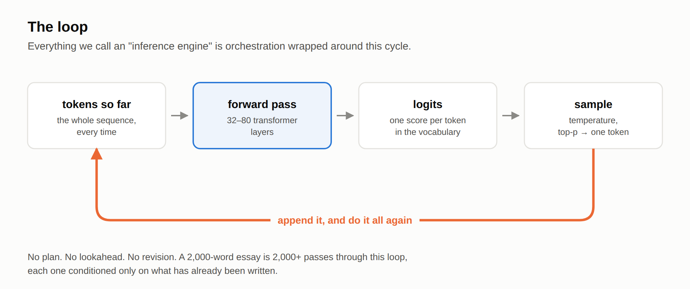
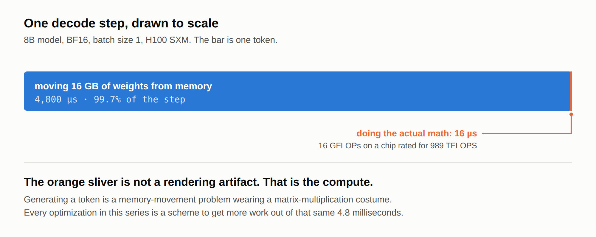
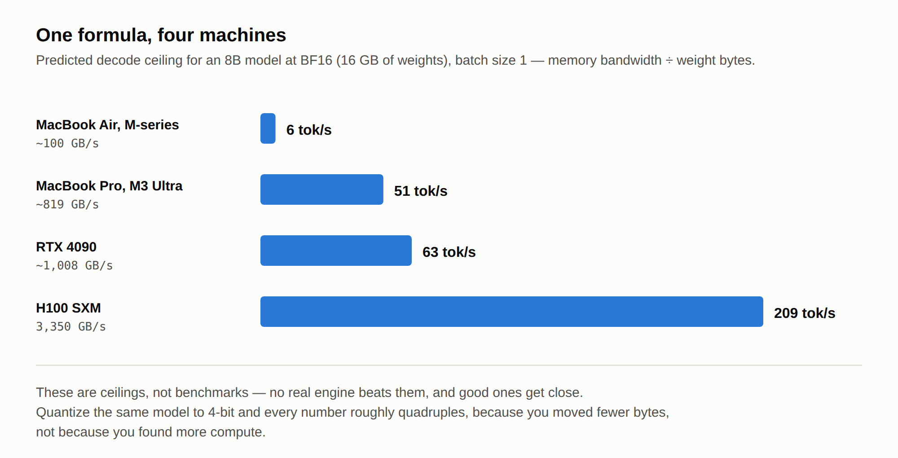

# The Life of a Token

### Inference from Scratch #1 — What actually happens when an LLM generates a token

*This is the first post in **Inference from Scratch** — me learning LLM inference in public, from a naive PyTorch loop all the way to writing a vLLM-style engine in Rust. I'm not an inference veteran; the deal is that nothing appears here unless I've derived it, run it, or measured it, and when I get something wrong I'll correct it in the open. New deep dive every Tuesday; a separate weekly digest, This Week in Inference, covers what changed in the field each week.*

---

Type a prompt into ChatGPT and the first word appears in roughly half a second. Every word after that takes a few tens of milliseconds — even though the model "read" your entire prompt almost instantly. Why is reading 1,000 words fast, but writing the 1,001st slow?

I used PyTorch for years before I could honestly answer that question — I could train and fine-tune models, but what happened *physically* on the GPU between two words of a streamed response was a black box. This post is the one I wish I'd read back then. We'll build the dumbest possible inference loop in ~50 lines of PyTorch, run it, and derive a one-line formula that predicts LLM generation speed on hardware from a MacBook to an H100 — out of two spec-sheet numbers and a single division. Whether the prediction survives contact with real silicon is Week 4's job, and I'll publish the misses along with the hits.

That formula is the thesis of this whole series: **inference is not a math problem. It's a memory problem.** Everything the field has invented — KV caches, paged attention, continuous batching, quantization, speculative decoding, disaggregated serving — is downstream of that one fact. But first, the machine itself.

## The cast of characters

Strip away the product surface and every LLM serving stack is five components.

The **tokenizer** turns your string into a sequence of integer IDs from a fixed vocabulary (~32K–256K entries depending on the model). It runs on the CPU, costs microseconds, and is the last time your text is text.

The **embedding table** maps each token ID to a vector — one row lookup in a matrix of shape `[vocab_size, hidden_dim]`. For an 8B-class model, hidden_dim is 4,096: your prompt is now a stack of 4,096-dimensional vectors.

The **transformer stack** — 24 to 80 layers of attention and MLP blocks — is where essentially all the parameters and all the FLOPs live. Each layer reads the running representation of every token, mixes information across positions (attention) and across features (MLP), and writes it back.

The **LM head** projects the final hidden state of the *last* position back onto the vocabulary: one `[hidden_dim, vocab_size]` matmul producing ~128K raw scores, the *logits*. Note what this means: however long your prompt, the model's entire output at each step is a single probability distribution over "what token comes next."

The **sampler** turns that distribution into a choice — and it's the only place randomness enters. Temperature rescales the logits, top-k/top-p prune the tail, and a random draw picks the winner. That token ID goes back through the tokenizer in reverse, and a word fragment streams to your screen.

## The loop

Here's the part that surprised me when I first traced through it: that's it. There is no plan, no sentence-level buffer, no lookahead. The model is a pure function:

> **(all tokens so far) → (probability distribution over the next token)**

Generation is just calling that function in a loop, appending each chosen token, and calling it again. The model that wrote a 2,000-word essay made 2,000+ isolated decisions, each conditioned only on what was already written. Everything we call an "inference engine" — vLLM, SGLang, TensorRT-LLM — is orchestration wrapped around this loop.



So let's write the loop with no orchestration at all.

```python
import time, torch
from transformers import AutoModelForCausalLM, AutoTokenizer

MODEL = "Qwen/Qwen2.5-0.5B-Instruct"   # swap in an 8B model if you have the VRAM
tok = AutoTokenizer.from_pretrained(MODEL)
model = AutoModelForCausalLM.from_pretrained(
    MODEL, torch_dtype=torch.bfloat16, device_map="auto"
).eval()

def generate(prompt: str, max_new_tokens: int = 128,
             temperature: float = 0.7, top_p: float = 0.9) -> str:
    ids = tok(prompt, return_tensors="pt").input_ids.to(model.device)
    t0, n = time.perf_counter(), 0
    for _ in range(max_new_tokens):
        with torch.no_grad():
            logits = model(ids, use_cache=False).logits[0, -1]   # full re-forward, every step
        probs = torch.softmax(logits / temperature, dim=-1)
        sp, si = torch.sort(probs, descending=True)
        keep = torch.cumsum(sp, 0) - sp < top_p                  # top-p (nucleus) filter
        probs = torch.zeros_like(probs).scatter(0, si[keep], sp[keep])
        next_id = torch.multinomial(probs / probs.sum(), 1)
        ids = torch.cat([ids, next_id.unsqueeze(0)], dim=-1)
        n += 1
        if next_id.item() == tok.eos_token_id:
            break
    dt = time.perf_counter() - t0
    print(f"{n} tokens in {dt:.2f}s -> {n/dt:.1f} tok/s")
    return tok.decode(ids[0])

print(generate("The capital of France is"))
```

Run it. It works — this is a complete, correct LLM inference server minus the server. It is also *catastrophically* slow, and slower per-token the longer the output gets. Note the `use_cache=False`: every step re-processes the entire sequence from scratch, so step 500 redoes all the work of steps 1–499. Fixing exactly that wastefulness is Week 3 (the KV cache). This loop is our series baseline — the number every future optimization will be measured against, all the way to the Rust engine we build at the end.

We ship two reference configs in the repo: **Qwen2.5-0.5B**, which runs on anything including free Colab, and **Llama-3.1-8B-class**, which is the model every number in this series is anchored to. Same code; only the model string changes.

## The napkin math that explains everything

Now the payoff. Here's the question that cracked this whole topic open for me: when the model generates one token at batch size 1, what is the GPU actually doing? I assumed the answer was "a lot of matrix math." I was wrong in an interesting way.

To produce a token, the GPU must perform a matmul against essentially **every weight matrix in the model**. Weights live in HBM, the GPU's main memory; the compute units can only multiply what's been streamed into their registers. So generating one token requires moving **every parameter of the model from memory to compute at least once**.

An 8B-parameter model in BF16 is ~16 GB of weights. An H100 SXM moves data from HBM at ~3.35 TB/s. So the *physics-imposed ceiling* is:

> **3,350 GB/s ÷ 16 GB ≈ ~210 tokens/second** — per request, batch size 1, no matter how clever your code is.

Meanwhile, how much *math* does that token take? Every weight gets multiplied once and added once, so roughly 2 FLOPs per parameter ≈ 16 GFLOPs. (That rule of thumb is doing real work here; next week we derive it properly and find out exactly when it stops holding.) An H100 does ~989 *TERA*flops of BF16 — so the arithmetic itself takes about **16 microseconds**, while moving the weights takes about **4.8 milliseconds**. The GPU spends roughly **0.3% of the step computing and 99.7% waiting on memory**. During decode, the world's most expensive matrix-multiplication machine is doing almost no matrix multiplication.



That ratio is the entire subject of this series — and here's the part that surprised me when I checked it. Run the same arithmetic for a 70B at BF16 and you get 140 GB of weights, ~42 ms of memory traffic, and ~142 µs of math. The imbalance: **295×**. Identical to the 8B. It has to be — the imbalance is (bytes ÷ bandwidth) ÷ (FLOPs ÷ compute), and both bytes and FLOPs scale with parameter count, so the model cancels out entirely. What's left is a property of the *chip*: 989 TFLOPS ÷ 3.35 TB/s ≈ **295 FLOPs per byte**, the H100's ops:byte ratio. Any operation doing less arithmetic than that per byte it touches is memory-bound on this hardware — and batch-1 decode does about *one*.

So model size doesn't change the imbalance. It changes what the imbalance costs you: that 70B's 140 GB doesn't fit on an 80 GB H100 at all, and on one H100's worth of bandwidth its batch-1 ceiling would be ~24 tok/s against the 8B's ~210 — which is why serving it begins by splitting it across GPUs and buying more bandwidth (Week 15). Bigger models don't hit a different wall — they hit the same wall harder. Every optimization in the next 29 weeks is, one way or another, a scheme to get more useful work out of that same memory traffic.

This one formula — **weights ÷ bandwidth** — travels remarkably well:



- **A MacBook** (M-series unified memory runs ~100 GB/s on a base chip up to 819 GB/s on an M3 Ultra): 16 GB of weights → roughly 6 tok/s at the low end, ~50 at the high end — assuming you have the RAM to hold it, which a base-chip machine doesn't. Quantize to 4-bit (~4.5 GB) and the same formula predicts 22–180 tok/s, and now it fits. That looks like the range llama.cpp users report, but I'm going on forum posts rather than my own runs, so treat it as a prediction until I put a number next to it in Week 4. Quantization is, first and foremost, a *bandwidth* optimization; that's Week 10.
- **H100 serving one user:** ~210 tok/s ceiling; real engines hit a healthy fraction of it.
- **The riddle from the top:** prefill (reading your prompt) processes *all* prompt tokens in one pass — the weights stream through HBM once for the whole prompt, and there's enough math to keep the compute units busy. Decode streams all weights *per token*. Reading is compute-shaped; writing is bandwidth-shaped. That asymmetry is Week 2, and it's the fault line the entire serving industry is organized around.

And notice the scandal hiding in the arithmetic: those 16 GB stream through HBM whether they produce one token or thirty-two. Serving 32 users in the same forward pass costs the same 4.8 ms of memory traffic — which turns a 0.3%-busy GPU into a usefully-employed one. That gap is worth billions of dollars a year, and Weeks 5–8 are about the machinery built to close it.

## Four things I had wrong about this loop

**"The model plans its answer."** It doesn't — one token at a time, no lookahead, no revision. I half-knew this and still caught myself reasoning as if the model "decided" on a sentence. (The interesting wrinkle, speculative decoding, *guesses* ahead and verifies; Week 16.)

**"Longer answers are slower because the questions are harder."** Every token costs the same forward pass whether the model is writing poetry or padding a disclaimer. Output length is a pure cost multiplier — which is why reasoning models that think in thousands of tokens rewired the economics of the field (Week 20).

**"Generation is slow because GPUs are slow at this math."** The napkin math above shows the opposite: the compute sits idle 99.7% of the step. Decode is a memory workload wearing a compute costume. This was the single biggest update to my mental model — and I only believed it once two separately-published books derived the same ratio from different starting points.

**"temperature=0 makes outputs reproducible."** In production, apparently not: floating-point reduction order isn't associative, and your request's batch companions can change the kernel shapes your tokens are computed with. Greedy decoding is deterministic in a vacuum; serving systems are not vacuums. (This one I've only partially verified myself — batch-companion effects need a serving setup we don't have until Week 5. If you've seen this bite in production, I'd love to hear the war story.)

## Where this series goes

We're deliberately ignoring three enormous things today: the re-computation waste in our loop (**KV cache**, Week 3), the fact that we served exactly one request (**batching**, Week 5 — the single highest-leverage idea in serving), and everything about kernels, quantization, parallelism, and scale (Phases 3–5). We'll also build the measurement harness this series will use for every benchmark (Week 4).

And it all converges somewhere concrete: in the final arc, we build our own inference engine in Rust — continuous batching, paged KV cache, prefix caching — and benchmark it against both today's naive loop and vLLM itself. Today's 50 lines are the villain of that story.

**Next week:** *Prefill vs. decode — why reading is cheap and writing is expensive.* The two-phase workload hiding inside every request, the roofline model, and the single distinction that explains half of modern serving architecture.

**Where the numbers came from.** The bandwidth-ceiling formula and the compute-idle ratio are derived from GPU spec sheets (H100 SXM: 3.35 TB/s HBM, 989 TFLOPS dense FP16/BF16) and cross-checked against two 2026 books that reach the same conclusions by different routes — Philip Kiely's *Inference Engineering* (Baseten) works it through an ops:byte ratio of ~295, and Vizuara's *Inference Engineering: The Definitive Workshop Guide* derives arithmetic intensity ≈ 1 for decode. Those two are the same number seen from opposite ends, which is why the 295× above is not a coincidence.

Two honest caveats on that 0.3%. First, it's the fraction of the *step's wall-clock* during which the compute units have work — if you instead compare 16 GFLOPs against a full second of H100 throughput you get a much smaller-looking number, and you'll see both framings in the literature; they're answering different questions. Second, the 16 µs assumes the arithmetic runs at peak, which a batch-1 decode step emphatically does not: those are skinny matrix-vector products that barely engage a tensor core. Both corrections push in the same direction — decode is *more* memory-bound than the clean numbers suggest, not less.

Where I've measured something myself I say so; where I'm standing on someone else's arithmetic, this is the someone else.

**Changelog.** Nothing yet. Corrections land here with credit — if you spot an error, you'll be named.

*Code for this post — both model configs plus `napkin.py`, a calculator that predicts your hardware's decode ceiling — is in the [companion repo](#) under `week1/`. Run it on your hardware and tell me how far off the prediction is; I'll publish a reader-submitted table. If you spot an error anywhere in this post, say so — corrections get credited in a changelog at the bottom. And if you want to learn this alongside me, subscribe: one deep dive every Tuesday, from scratch to state of the art.*
